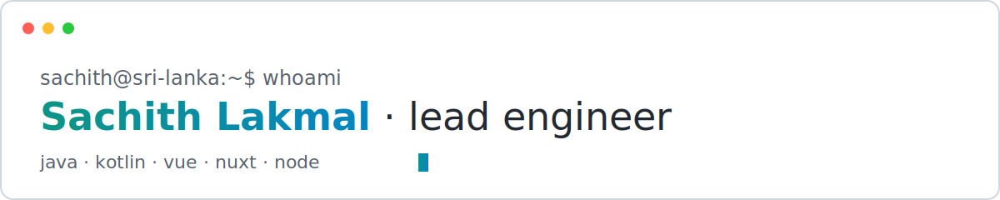

<picture>
  <source media="(prefers-color-scheme: dark)" srcset="assets/header-dark.svg">
  
</picture>

## ⚡ Recent activity

<!--START_SECTION:activity-->
<!--END_SECTION:activity-->

## 📊 Stats

  
  
   
  

<picture>
  <source media="(prefers-color-scheme: dark)" srcset="https://raw.githubusercontent.com/sachith89/sachith89/output/github-contribution-grid-snake-dark.svg">
  
</picture>

## 🛠 Skills

  
  
  
  
  
  
  
  
  
  

## 🤝 Connect

  
  
  
  
    
  

